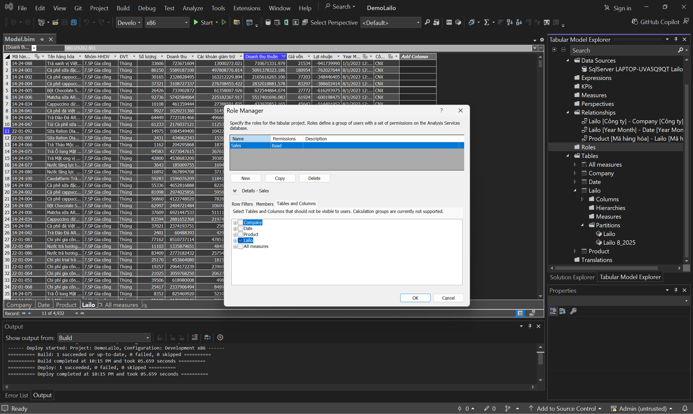
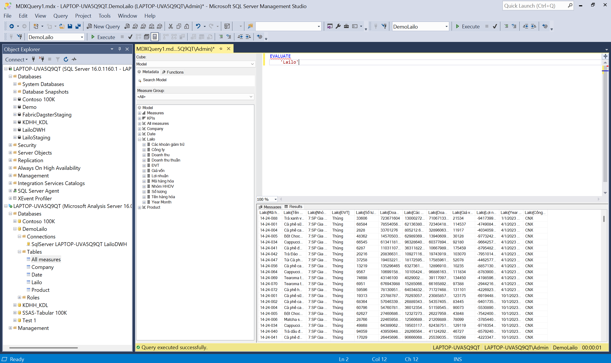

# End-to-End Business Intelligence Pipeline

> A comprehensive Data Engineering and BI solution demonstrating a complete workflow from raw data ingestion to semantic modeling and reporting.

## 📖 Overview

This project implements a robust data pipeline that orchestrates the flow of data from various sources (Excel, SharePoint) into a Data Warehouse, followed by a Semantic Layer (SSAS) and Reporting (Power BI).

**Architecture:**


---

## 🚀 Key Features & Implementation

### 1. Orchestration with Dagster
The entire ETL process is managed via Dagster. The UI provides a clear timeline of the execution, from extracting Excel files to loading data into the Data Warehouse.


*Run Timeline: Visualizing the execution of assets (Source -> Staging -> DW)*

### 2. Semantic Modeling (Star Schema)
Data is transformed into a Star Schema. The **SSAS Tabular Model** defines relationships between Fact tables (`Lailo`) and Dimensions (`Company`, `Date`, `Product`).


*Diagram View: Entity-Relationship Diagram in Visual Studio*

### 3. SSAS Features

* **Row-Level Security (RLS):**
    Security roles (e.g., "Sales") are configured to restrict data access based on specific business rules.
    

* **Partition Management:**
    Tables are partitioned (e.g., by month/year) to optimize processing time and manage large datasets efficiently.
    

* **Automated Deployment:**
    The model is deployed directly from Visual Studio to the Analysis Services Server.
    

### 4. Data Validation (DAX)
We verify the data accuracy by running DAX queries (`EVALUATE`) directly against the Cube using SSMS.



---

## ⚙️ Setup & Installation

To run this project locally, please follow these commands strictly to set up the environment and dependencies.

### Prerequisites
* Python 3.10+
* SQL Server
* Visual Studio (with SSAS extension)

### Installation Steps (Manual)
Open your terminal (PowerShell/CMD) at the project root and run the following commands:
```powershell
# 1. Create Virtual Environment (folder name: .env)
py -m venv .env

# 2. Activate Environment (Important!)
.\.env\Scripts\activate

# 3. Install required libraries
# Installs Dagster, Webserver, DuckDB, Pandas, SQL drivers, and Excel support
pip install jupyter dagster dagster-webserver duckdb pandas sqlalchemy pyodbc openpyxl python-tabular

# 4. Initialize Dagster Project (Optional - Only if starting fresh)
dagster project scaffold --name FabricDagster

# 5. Navigate to the project folder
cd Dagster

# 6. Install the project in editable mode
pip install -e ".[dev]"

# 7. Usage
dagster dev
